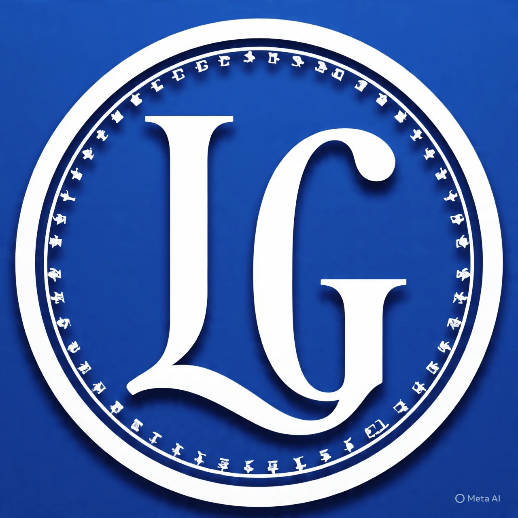

  

**LGC Miner ⛏️**

*The bridge was lagging. We fixed it.*  
*Tap to mine $LGC — the token for every TON degen with a pending tx.*

## 🚀 About LGC Miner

**LGC Miner** is a fun Telegram Mini App play-to-earn game built on the **TON Network**.

Turn frustrating bridge delays and pending transactions into real gains.  
Stop refreshing the explorer — start tapping and mining $LGC.

## 🎮 How to Start Mining

1. **Launch the Bot**: [https://t.me/LGC_Miner_Bot](https://t.me/LGC_Miner_Bot) → Send `/start`
2. **Mine for Free**: Open the Mini App and tap the big button to earn $LGC
3. **Complete Tasks & Referrals**: Get 2x–5x boosts and earn from friends you invite
4. **Withdraw**: Go to the [Dashboard](https://lgcminer.vercel.app/) and claim your $LGC (0.1 TON gas fee)

## 💎 Features

- **Instant Telegram Mini App** — No downloads, runs inside Telegram
- **Free Mining** — Tap to earn with zero hardware requirements
- **Real On-Chain $LGC** — Fully verified Jetton on TON
- **Tasks + Referral System** — Daily tasks and passive earnings from referrals
- **Live Dashboard** — Real-time balance and stats at [lgcminer.vercel.app](https://lgcminer.vercel.app/)
- **Easy Withdrawals** — Send earned $LGC to your Tonkeeper/MyTonWallet (0.1 TON flat gas fee)

## 📊 Token Details

- **Network**: TON
- **Contract Address**: `EQBcICgWV92L-PezljUf_6J7PnpVUlJmhp1QlctbwulKbn8j`
- **Explorer**: [View on Tonscan](https://tonscan.org/jetton/EQBcICgWV92L-PezljUf_6J7PnpVUlJmhp1QlctbwulKbn8j)

## 🔗 Links

- **Mini App**: [t.me/LGC_Miner_Bot](https://t.me/LGC_Miner_Bot)
- **Dashboard**: [lgcminer.vercel.app](https://lgcminer.vercel.app/)
- **Community**: [t.me/PrimeChat001](https://t.me/PrimeChat001)
- **Contract**: [tonscan.org/jetton/EQBcICgWV92L-PezljUf_6J7PnpVUlJmhp1QlctbwulKbn8j](https://tonscan.org/jetton/EQBcICgWV92L-PezljUf_6J7PnpVUlJmhp1QlctbwulKbn8j)

## 💬 Community & Support

Questions, feedback, or bugs? Join the community:  
[https://t.me/PrimeChat001](https://t.me/PrimeChat001)

## ⚠️ Disclaimer

LGC Miner is a community-driven Telegram play-to-earn game. $LGC is a meme/community token on the TON blockchain.  
Earnings depend on your activity and referrals. This is **not financial advice**. Always DYOR.

---

*Stop waiting for the bridge. Start mining the lag.* ⏳🚀

.
